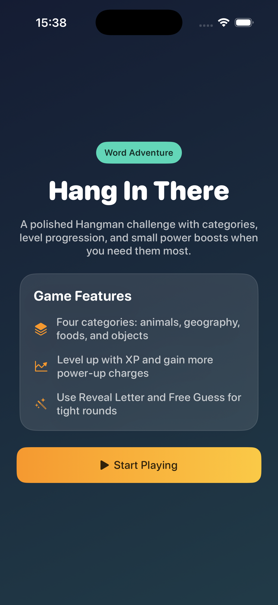
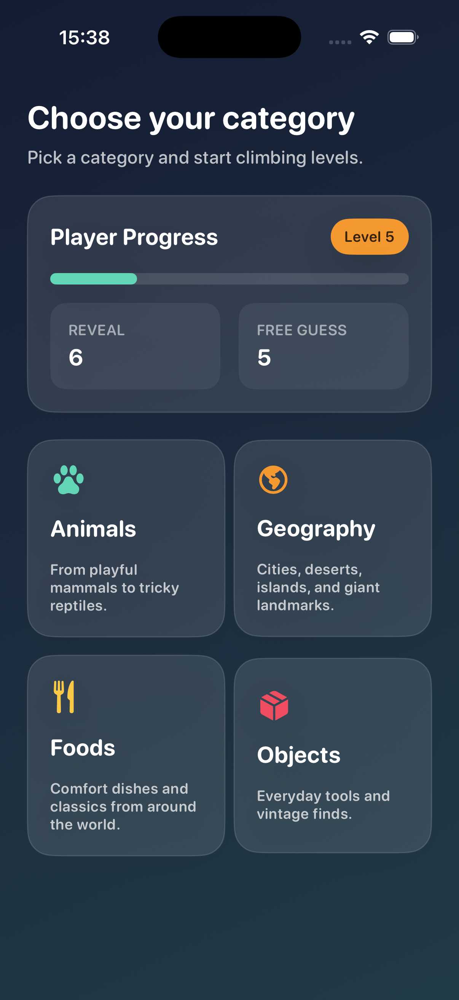
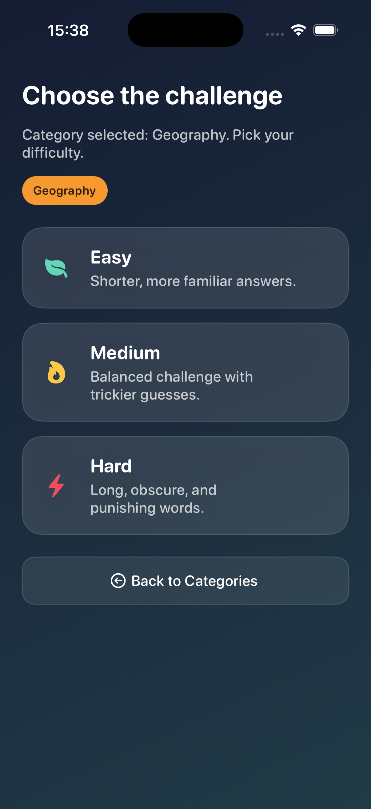
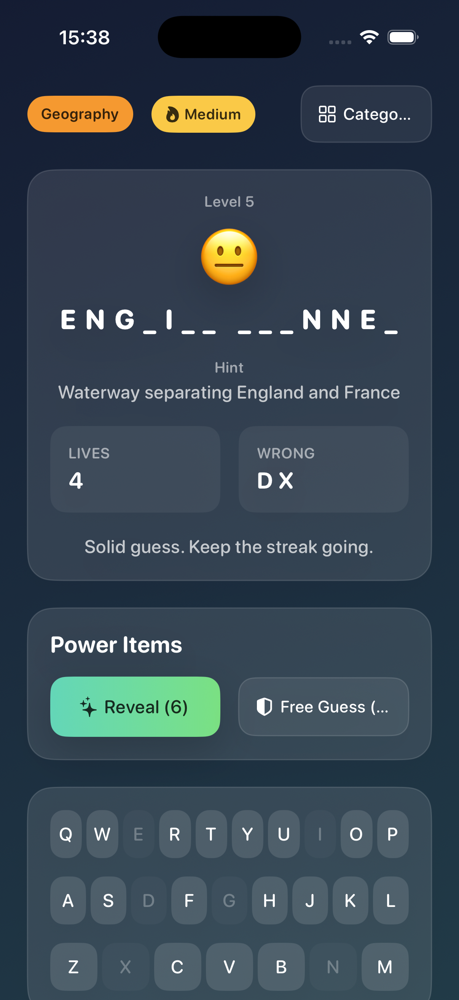

# HangInThere

`HangInThere` is a SwiftUI iOS hangman-style game with category-based rounds, difficulty modes, player progression, and power-ups.

For the full internal project documentation, see [`PROJECT_OVERVIEW.md`](./PROJECT_OVERVIEW.md).

## Current Features

- 4 categories:
  - Animals
  - Geography
  - Foods
  - Objects
- 3 game modes:
  - Easy
  - Medium
  - Hard
- 100 items per category
- hint-based gameplay
- XP and player level progression
- power-ups:
  - Reveal Letter
  - Free Guess
- persistent local progress with `UserDefaults`
- unit tests and UI tests

## App Flow

1. Splash screen
2. Category selection
3. Difficulty selection
4. Gameplay
5. Round summary

## Tech Stack

- Swift
- SwiftUI
- MVVM
- feature-based folder organization
- repository pattern
- use case pattern

## Project Structure

- `HangInThere/App`
- `HangInThere/Features`
- `HangInThere/Shared`
- `HangInThereTests`
- `HangInThereUITests`

## Architecture Summary

The app uses a feature-oriented MVVM structure:

- `View`
  - SwiftUI screens and reusable UI components
- `ViewModel`
  - observable state and presentation orchestration
- `Domain`
  - entities and game rules
- `Data`
  - repositories and persistence

The app is composed from the root in `HangInThereApp.swift`, where repositories are injected into the app flow and gameplay view models.

## Architecture Diagram

```text
HangInThereApp
    |
    v
 MainView
    |
    v
 AppViewModel -----------------------> AppFlowUseCases
    |
    v
 HangmanGameViewModel
    |
    +--> ViewStates
    +--> GameplayUseCases
    +--> ProgressionUseCases
    +--> WordRepository
    +--> ProgressRepository
             |
             +--> InMemoryWordRepository
             +--> UserDefaultsProgressRepository
```

## Screenshots

### Splash


### Category Selection


### Difficulty Selection


### Gameplay


## Testing

- Unit tests cover app flow, domain logic, and view models.
- UI tests cover the main playable flow.
- UI tests run with deterministic data for stability.

## Future Direction

The project is already structured to support future features such as:

- ranking / leaderboard
- player profiles
- remote data sources
- more categories and modes

## Documentation

- Quick start and summary: [`README.md`](./README.md)
- Full project documentation: [`PROJECT_OVERVIEW.md`](./PROJECT_OVERVIEW.md)
