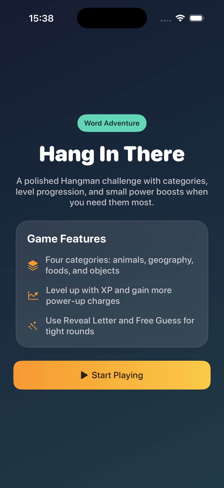
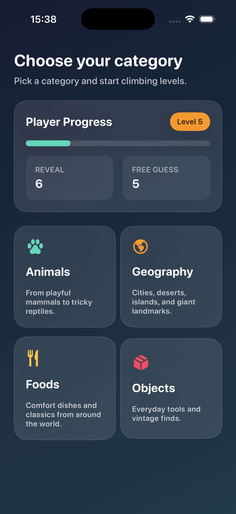
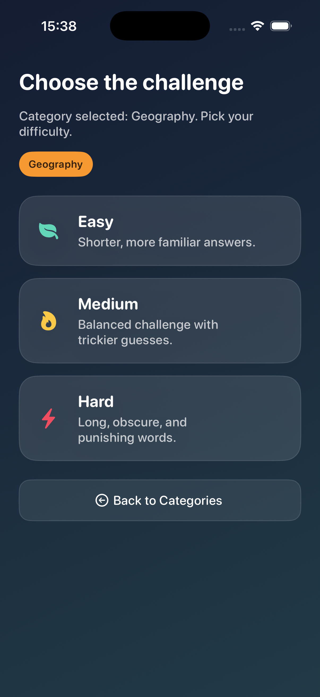
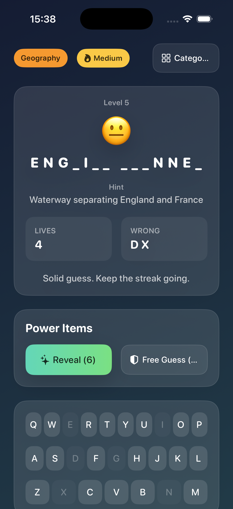

# HangInThere

`HangInThere` is a SwiftUI iOS hangman-style game with category-based rounds, difficulty modes, player progression, and power-ups.

For the full internal project documentation, see [`PROJECT_OVERVIEW.md`](./PROJECT_OVERVIEW.md).

## Current Features

- 4 categories:
  - Animals
  - Geography
  - Foods
  - Objects
- 3 game modes:
  - Easy
  - Medium
  - Hard
- 100 items per category
- hint-based gameplay
- XP and player level progression
- power-ups with milestone-based unlocks and capped refills:
  - Reveal Letter
  - Free Guess
- persistent local progress with `UserDefaults`
- daily quests with claimable XP rewards and Sunday bonus XP
- daily quest generation now avoids power-up usage quests before power-ups are unlocked
- in-progress round resume per category and difficulty, preserving guessed letters and round state
- level selection surfaces a `Resume` indicator when a saved round exists for that difficulty
- bundled sound effects and haptic feedback for gameplay and rewards
- settings screen for sound and haptics
- custom visual asset set for:
  - splash branding
  - category artwork
  - difficulty badges
  - power-up artwork
  - sliced hangman gameplay illustration
- unit tests and UI tests

## App Flow

1. Splash screen
2. Category selection
3. Difficulty selection
4. Gameplay
5. Round summary

## Tech Stack

- Swift
- SwiftUI
- MVVM
- feature-based folder organization
- repository pattern
- use case pattern

## Project Structure

- `HangInThere/App`
- `HangInThere/Features`
- `HangInThere/Shared`
- `HangInThereTests`
- `HangInThereUITests`

## Architecture Summary

The app uses a feature-oriented MVVM structure:

- `View`
  - SwiftUI screens and reusable UI components
- `ViewModel`
  - observable state and presentation orchestration
- `Domain`
  - entities and game rules
- `Data`
  - repositories and persistence

The app is composed from the root in `HangInThereApp.swift`, where repositories are injected into the app flow and gameplay view models.

## Architecture Diagram

```text
HangInThereApp
    |
    v
 MainView
    |
    v
 AppViewModel -----------------------> AppFlowUseCases
    |
    v
 HangmanGameViewModel
    |
    +--> ViewStates
    +--> GameplayUseCases
    +--> ProgressionUseCases
    +--> WordRepository
    +--> ProgressRepository
             |
             +--> InMemoryWordRepository
             +--> UserDefaultsProgressRepository
```

## Screenshots

<p align="center">
  
  
</p>

<p align="center">
  
  
</p>

## Testing

- Unit tests cover app flow, domain logic, and view models.
- UI tests cover the main playable flow.
- UI tests run with deterministic data for stability.
- SwiftUI accessibility can expose custom composed views under different element types, so UI tests prefer stable accessibility identifiers and, when needed, `descendants(matching: .any)` instead of assuming `buttons`, `staticTexts`, or `otherElements`.

## Recent Work

- The splash screen was redesigned around custom background, emblem, and logo artwork instead of text-only branding.
- Category selection now uses illustrated category cards with normalized card heights.
- Difficulty selection now uses custom badge artwork for `Easy`, `Medium`, and `Hard`.
- Gameplay now uses custom power-up artwork and a custom hangman illustration instead of only system symbols and native-only placeholders.
- Gameplay now uses layered hangman body-part assets for mistake progression instead of the old native line drawing.
- Gameplay now uses bundled sound effects for guesses, powers, wins/losses, level-ups, sound toggle, and quest reward claiming.
- The quest screen now shows the player’s current level and XP progress toward the next level.
- Category selection and settings now preview the player’s next power-up reward milestone.
- Level selection now marks difficulties that already have a saved in-progress round with a resume indicator.
- Win summaries now surface explicit level-up feedback and power-up reward feedback.
- Leaving a round and returning later now resumes the saved in-progress round for that exact category and difficulty, including already guessed letters.
- The settings sheet now provides separate sound and haptic controls with local persistence.
- Daily quest generation now skips impossible `Use 1 power-up` quests until the player has actually unlocked power-ups.
- The gameplay screen was reworked so lives, wrong guesses, and power actions live directly around the hangman area instead of in separate wide sections.
- Power actions now use icon-based controls with charge counts and on-use visual feedback.
- Power actions now use dedicated `revealPower` and `freeGuessPower` artwork assets.
- Word selection now picks randomly from the remaining words in each category and difficulty pool, instead of consuming a single stable shuffled order.
- The gameplay hint now briefly highlights with a left-to-right sweep when a new round loads.
- Wrong guesses in the compact gameplay badge now wrap cleanly in grouped lines instead of truncating.
- The asset catalog is now grouped into folders such as `categories`, `powerUps`, `difficulty`, `hangman`, `branding`, and `backgrounds` for easier maintenance.
- Root safe-area handling was adjusted so the splash remains visually full-screen while scrollable screens do not expose content under the status bar.

## Future Direction

The project is already structured to support future features such as:

- ranking / leaderboard
- player profiles
- remote data sources
- more categories and modes
- source-asset normalization, so category and difficulty artwork can share consistent visual bounds without UI-side scale adjustments

## Documentation

- Quick start and summary: [`README.md`](./README.md)
- Full project documentation: [`PROJECT_OVERVIEW.md`](./PROJECT_OVERVIEW.md)
